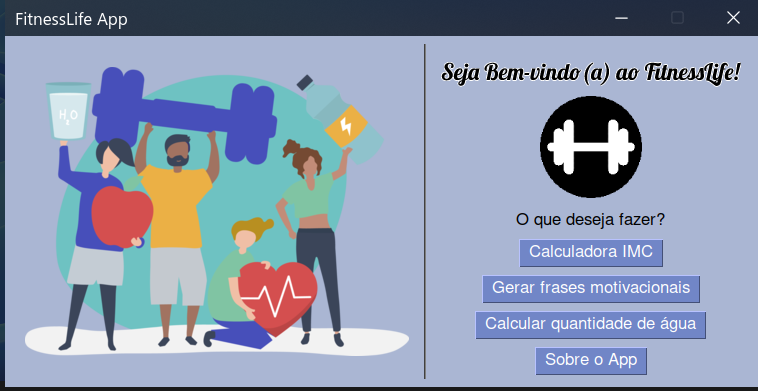
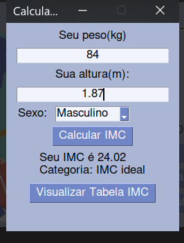
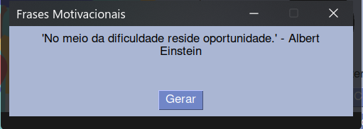
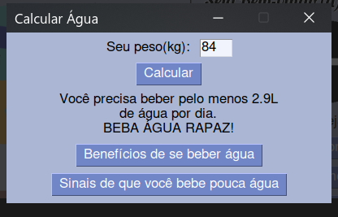

# 🏋️‍♂️ FitnessLife App
## __App Desktop com funcionalidades pra quem leva uma vida saudável__
***
### __*Funcionalidades:*__
- Calculadora IMC
    - Informe seu peso, altura e sexo para  calcular seu IMC
- Gerador de frases motivacionais
    - Receba frases motivacionais aleatórias
- Calcular quantidade ideal de água que você deve beber durante o dia
    - Informe seu peso e veja quantos litros (L) de água você deve beber durante o dia
    - Veja os benefícios de beber água
    - Veja sinais de que você anda bebendo pouca água
***
### 🖥️ __*Tela do Aplicativo*__

### 🛠️ *Tecnologia utilizada*
- Python 3.10
    - Biblioteca PySimpleGUI para criar interface gráfica
- API
    - Utilizando a biblioteca 'requests' para receber dados da ZenQuotesAPI